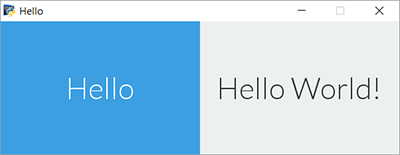

This very basic example demonstrates how simple it is to get started with Antlia.

The goal here is to show a button that, once clicked, will change the text displayed by a label next to it.

We only need two files:

* `helloworld.py` which will contain our Python code that will use *Antlia*,
* `helloworld_layout.lia` which will contain the layout of our simple example.

Let's start by importing *Antlia* into our Python script

```python
from antlia import *
```

Now we can create a GUI object. A layout file needs to be specified. This layout file contains the structure of the GUI.

Even though this layout file has a `.lia` extension, only its name has to be passed to the constructor of the `Antlia` object.

```python
GUI = Antlia("helloworld_layout")
```

Open the `helloworld_layout.lia` file, and write the following lines

```json
.title Hello World
.resolution 600px 200px

grid main_grid
	.rows 100%
	.cols 50% 50%

	button hello_button
		.label Hello
		.text-size 45

	label hello_label
		.label No
		.text-size 45
		.align center
		.text-color dark-grey
```

The structure of this file is quite easy to understand. The **elements** composing the GUI are declared by their names, and some **attributes** starting with `.` are given in the following lines.

The attributes specified at the beginning of the layout file are relevant to the window.

Back to the Python script, it is time to define the button's handler.

```python
def buttonClickHandler():
	# Change the content of the label
	GUI.change("hello_label", "label", "Hello World!")

# Bind the handler to the button
GUI.bind("hello_button", "click", buttonClickHandler)
```


Whenever the `hello_button` attached to `buttonClickHandler` is clicked, the  latter is called.

The handler will change the value of the `label` property of the `hello_label` to *Hello World!*

Once every element of the GUI has been bound to their respective handlers, the GUI can be built and the window be shown.

```python
GUI.start()
```

A forever loop will wait for the user to click on the exit button on top of the window to leave the program (the ``time`` module needs to be imported).

```python
while not GUI.getUserInfo().want_to_stop:
	# Give some rest to the CPU
	time.sleep(0.1)
```


Finally, after the window is closed, we properly quit the GUI.::

```python
GUI.quit()
```

The full Python script used for this example is given below.::

```python
from antlia import *
import time as ti

# Create a GUI based on a layout file
GUI = Antlia("helloworld_layout")

# Define a handler for the button
def buttonClickHandler():
	# Change the content of the label
	GUI.change("hello_label", "label", "Hello World!")

# Bind the handler to the button
GUI.bind("hello_button", "click", buttonClickHandler)

# Open the GUI window
GUI.start()

# Main loop, wait for stop event
while not GUI.getUserInfo().want_to_stop:
	# Give some rest to the CPU
	ti.sleep(0.1)

# Destroy the GUI properly
GUI.quit()
```

Here is the result:


